<h3><code>vidyansh@github ~ $ whoami</code></h3>

<table>
<tr>
<td valign="top"></td>
<td valign="top"></td>
</tr>
</table>

  

<h3><code>vidyansh@github ~ $ ./contributions.sh</code></h3>

  

<h3><code>vidyansh@github ~ $ ./connect.sh</code></h3>

<b>Open Source Contributor · Kubernetes · Go</b>

<a href="https://github.com/reckless-sherixx">github.com/reckless-sherixx</a>

